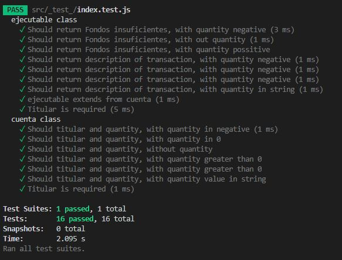

## Reto para el curso de programación orientada objetos, debes realizar el ejercicio en el lenguaje de tú preferencia.

## 1 Crea una clase llamada Cuenta
## 2 Crea una Clase llamada Ejecutable (donde ejecutaras los metodos de la clase cuenta)

La clase Cuenta tendrá los siguientes atributos: titular y cantidad (puede tener tipo de dato decimal).
La clase Ejecutable es la que ejecutara los metodos ingresar & retirar.

- El atributo titular debe de ser obligatorio y la cantidad debe de ser un parametro opcional. 

- Crear un constructor para la clase Cuenta que cumpla lo anterior.
- Crear sus métodos get, set y toString (Con toString pintas la información).

- La clase Cuente Tendrá dos métodos especiales:
Ingresar(float cantidad): se ingresa una cantidad a la cuenta, si la cantidad introducida es negativa, no se hará nada.
Retirar(float cantidad): se retira una cantidad a la cuenta, si restando la cantidad actual a la que nos pasan es negativa, la cantidad de la cuenta pasa a ser 0

## 3 Test

